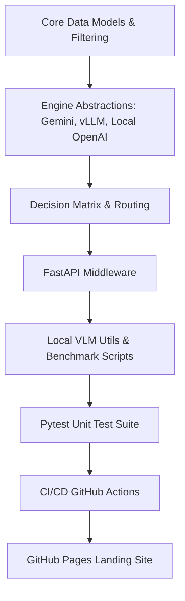

# Master Execution Plan (`PLAN.md`)

This master execution plan provides a persistent, stateful checklist for the initialization, development, testing, and deployment of the `multimodal-uncertainty` library.

---

## Blueprint Overview

---

## Phase Execution Checklist

### Phase 1: Package Structure & Core Modules
- [x] Scaffolding package metadata (`pyproject.toml`, `LICENSE`, `README.md`)
- [x] Implement core data structures (`src/multimodal_uncertainty/models.py`)
- [x] Implement token filtering algorithm (`src/multimodal_uncertainty/filtering.py`)
- [x] Implement decision matrix rules (`src/multimodal_uncertainty/decision.py`)

### Phase 2: Engine Implementations
- [x] `GeminiUncertaintyEngine` (`src/multimodal_uncertainty/engines/gemini.py`)
- [x] `VLLMUncertaintyEngine` (`src/multimodal_uncertainty/engines/vllm.py`)
- [x] `LocalOpenAIUncertaintyEngine` (`src/multimodal_uncertainty/engines/local_openai.py`)

### Phase 3: Middleware & Integrations
- [x] FastAPI response middleware (`src/multimodal_uncertainty/middleware/fastapi.py`)

### Phase 4: Local Utilities & Cat vs Dog Benchmark
- [x] Synthetic test image generator (`utils/generate_test_image.py`)
- [x] Local VLM client runner (`utils/local_vlm_runner.py`)
- [x] Cat vs Dog uncertainty prompt benchmark (`utils/demo_cat_dog_test.py`)

### Phase 5: Automated Testing
- [x] Test models initialization (`tests/test_models.py`)
- [x] Test token logprob filtering (`tests/test_filtering.py`)
- [x] Test decision matrix evaluate logic (`tests/test_decision.py`)
- [x] Test engines & mock API callers (`tests/test_engines.py`)

### Phase 6: Governance, CI/CD, & Portal
- [x] `AGENTS.md` and `INTENT.md` specification files
- [x] `CONTRIBUTING.md` contribution guidelines
- [x] GitHub Actions workflow for CI testing (`.github/workflows/ci.yml`)
- [x] GitHub Actions workflow for PyPI packaging (`.github/workflows/publish.yml`)
- [x] GitHub Pages static showcase site (`website/index.html`, `website/styles.css`)

---

## Recovery & Continuation Protocol

If context state is reset or execution moves to a fresh environment:
1. Verify package status: `python -m pytest`
2. Run local benchmark test: `python utils/demo_cat_dog_test.py --mock`
3. Inspect roadmap and open GitHub issues to resume targeted task execution.
